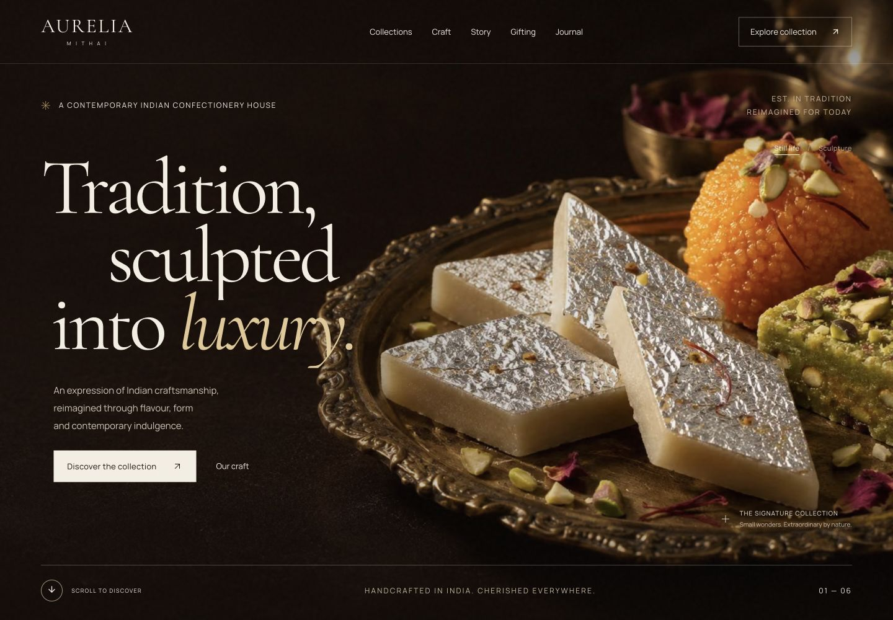
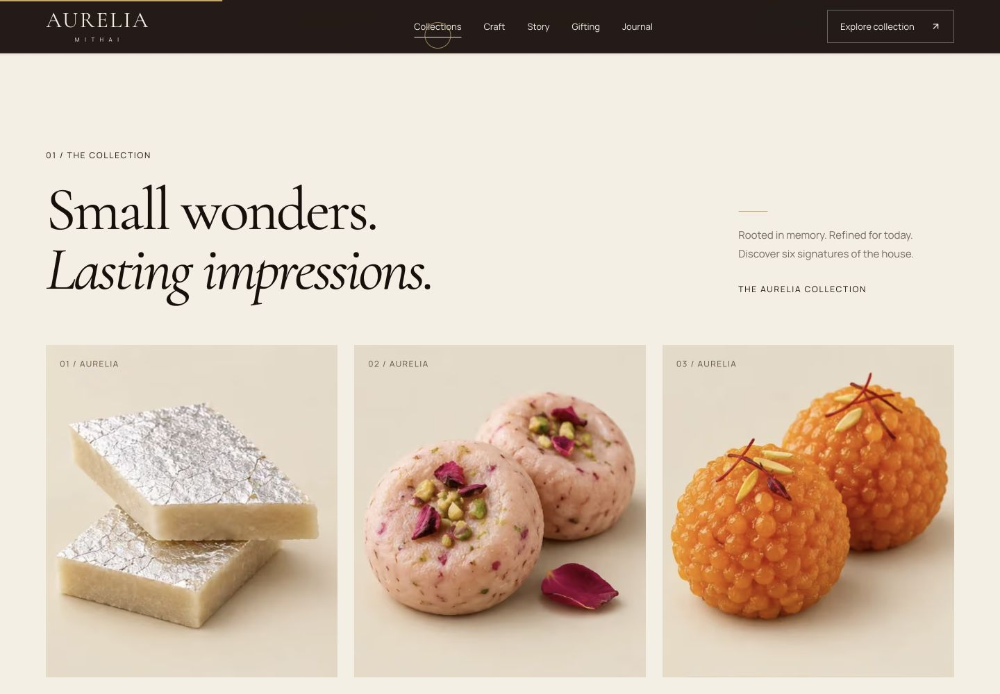
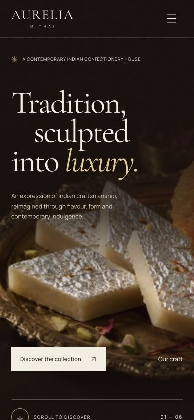

# AURELIA MITHAI

### Tradition, Sculpted Into Luxury.

An original, cinematic portfolio experience for a fictional luxury Indian confectionery house. Editorial typography, original campaign imagery, procedural 3D sweets, and considered motion bring traditional mithai into a contemporary luxury setting.

This is a complete showcase website, including a six-product collection, interactive product details, a scroll-driven brand film, a craft narrative, gifting, journal articles, and validated enquiry and newsletter flows. It is not a functioning sweet shop: there is no checkout, payment processing, or real brand affiliation.

## Experience

- Full-screen photographic opening with an optional live sculpture view on desktop.
- Four-chapter pinned scroll story synchronized with a floating silver-leaf kaju katli.
- Six product detail dialogs with ingredient notes, indicative prices, allergens, and 3D exploration.
- Horizontal flavour story on desktop; native swipe and button navigation on smaller screens.
- Sticky craft imagery and scroll-responsive process stages, with accessible manual controls.
- Interactive luxury gift box with a scroll-driven separating lid.
- Bespoke enquiries with occasion preselection and validated server endpoints.
- Newsletter loading, error, and clear demo confirmation states.
- Three fully written, individually shareable journal articles.
- Custom pointer, magnetic buttons, clipping reveals, restrained marquees, scroll progress, and counted statistics.
- Fullscreen mobile navigation, native dialog focus trapping, keyboard dismissal, and reduced-motion alternatives.
- Metadata, canonical URLs, Open Graph/X cards, structured data, sitemap, robots, favicon, and bespoke 404.

## Technology

Next.js **16.3.5** App Router · React **19.2.8** · TypeScript · Tailwind CSS 4 · Framer Motion · GSAP/ScrollTrigger · Lenis · Three.js · React Three Fiber/Drei · Lucide · Zod.

All versions are pinned and `package-lock.json` is committed. React 19.2.8 and Three.js 0.180.0 are intentional compatibility selections for the renderer. Next.js uses the current stable release verified during implementation.

## Run locally

Use Node.js 22.6 or later (verified on 22.19), and npm.

```bash
npm ci
npm run dev
```

Open [localhost:3000](http://localhost:3000). No credentials or environment variables are needed for the complete showcase.

```bash
npm run lint
npm run typecheck
npm test
npm run build
npm start
```

Check all routes, assets, metadata, and the form response paths against a running server:

```bash
node scripts/check-routes.mjs http://127.0.0.1:3000
```

`npm run format:check` checks formatting. `npm run format` formats source and documentation.

## Deploy to Vercel

1. Push this directory to a GitHub repository.
2. In Vercel, choose **Add New → Project** and import the repository.
3. Use the **Next.js** framework preset, the repository root, `npm ci`, and `npm run build`. Leave the output directory at its framework default.
4. Deploy. No environment variables are required for the showcase.
5. Optionally set `NEXT_PUBLIC_SITE_URL` to the final production/custom-domain origin and redeploy. Without it, Vercel's production-domain environment variable supplies the canonical origin automatically; local builds fall back to localhost.

This project includes Next.js route handlers and should be deployed as a Next.js application, not a static export.

## Forms and optional service integration

**Default behavior is deliberately transparent.** The server validates submissions and returns `{ "ok": true, "demo": true }`. The UI explains that nothing was sent, subscribed, or stored. It never claims a real enquiry was delivered in demo mode.

To connect a real form service, set these server-side environment variables in your deployment dashboard:

| Variable                | Purpose                                         |
| ----------------------- | ----------------------------------------------- |
| `AURELIA_FORMS_WEBHOOK` | An HTTPS endpoint accepting JSON POST requests  |
| `AURELIA_FORMS_SECRET`  | Optional bearer token sent only from the server |
| `NEXT_PUBLIC_SITE_URL`  | Optional public canonical website origin        |

The delivery payload contains `kind` (`inquiry` or `newsletter`), `data`, and `submittedAt`. The forwarding request has an eight-second timeout, rejects redirects, and returns a useful error when delivery fails. Inputs have size limits, optional phone/quantity validation, a honeypot, and browser origin checks. Never add the webhook secret to a `NEXT_PUBLIC_` variable.

Before adapting this showcase for real data collection, supply the business's actual privacy/consent text and configure provider-side abuse protection. The `.example` email is intentionally non-operational.

## Project map

```text
app/                    Pages, global design tokens, metadata, API routes
components/sections/    Independent editorial and interactive sections
components/three/       Lazy-loaded procedural sweets and gift box
components/ui/          Dialog, button, and reveal primitives
components/             Navigation, global motion, footer, enquiry modal
hooks/                  Reusable scroll helpers
lib/                    Content, validation, form delivery, site configuration
public/images/          Ten optimized, self-contained WebP assets
public/fonts/           Local WOFF2 fonts and their OFL licenses
scripts/                Route verification and original asset processing
 docs/                  Asset prompts, QA notes, screenshots
```

## Performance and accessibility

The home and editorial pages are pre-rendered. The renderer is dynamically imported only for an eligible visible scene, and unmounted outside the viewport, while the page is hidden, or behind an unrelated dialog. Desktop DPR is capped at 1.5; shadows and environment maps use bounded resolutions. Procedural textures are disposed and GSAP scopes, observers, media listeners, timers, and Lenis instances are cleaned up.

Phones and tablets under 900px receive photographic scene fallbacks, native scrolling, and a swipeable story. Product 3D is available on demand. Reduced-motion preferences disable major camera motion, smooth scrolling, the preloader, marquee, and parallax. There are no external model/HDR/font requests at runtime.

The original hero is approximately 216 KB; all ten image assets total about 1 MB. The three locally hosted WOFF2 fonts total approximately 60 KB. Next Image provides responsive sizes and WebP/AVIF negotiation. These are implementation characteristics, not an invented Lighthouse score; a Lighthouse report is not bundled.

Native `<dialog>` supplies focus containment and Escape dismissal. Dialogs restore focus to the opener, navigation has visible focus styles, and all forms have labels. Meaningful photographs include alternative text, while decorative motion is excluded where appropriate.

## Screenshots

Captured from the running production build during QA:







## Creative assets

Campaign images were generated specifically for this fictional brand with the built-in image generation tool. The original prompts are documented in `docs/asset-prompts.json`. The catalog contact sheet was separated into six product images and optimized with Sharp. All production assets live in `public/`; none depend on a developer's local asset folder.

Cormorant Garamond and Manrope are locally hosted under their SIL Open Font Licenses, included in `public/fonts/`. The 3D sweets and box are procedural geometry. No GLB files or external assets are required.

The brand, products, claims, indicative prices, and testimonials are fictional. Social links go to platform homepages. This experience is intended for portfolio presentation and adaptation, with appropriate review before use for a real business.
